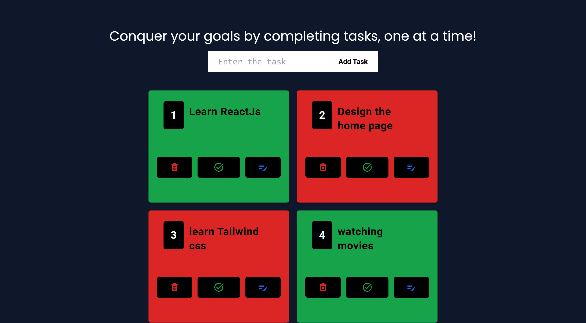

# Todo List
## A simple and responsive Todo List application built with React. This app allows users to add, delete, and edit tasks. It is designed to work seamlessly across various devices, providing a smooth and intuitive experience.

## Features
### **Add Tasks**: Easily add new tasks to your to-do list.
### **Delete Tasks**: Remove completed or unwanted tasks with a single click.
### **Edit Tasks**: Modify existing tasks to keep your list up to date.
### **Responsive Design**: The app is fully responsive and works on desktop, tablet, and mobile devices.

## Technologies Used
### **React**
### **Tailwind CSS**
### **Material Ui for Adding icons**
[Live Demo](https://a-react-todolist.netlify.app/)

### **In Big Screen**

### In Small Screen

